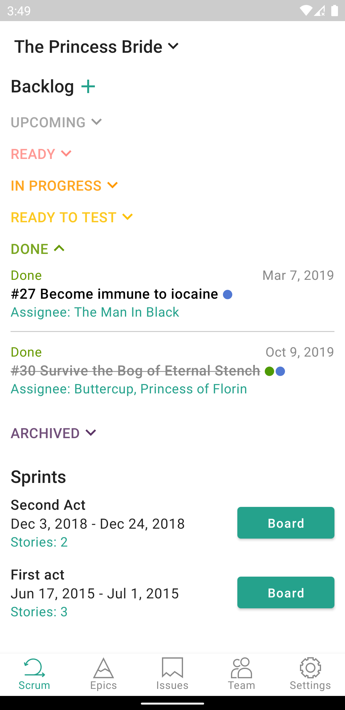
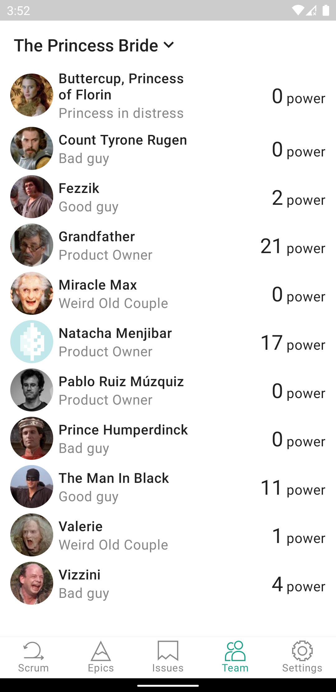

# TaigaMobile
This is unofficial android app for [taiga.io](https://www.taiga.io/) (agile project management system) built with [Jetpack Compose](https://developer.android.com/jetpack/compose) (brand new UI toolkit from Google).  
Project is still under development, so new features will be added in future.  

## Screenshots
Here are some screenshots (dark theme supported) 
  
   
   

## Download
Check out [Releases](https://github.com/EugeneTheDev/TaigaMobile/releases) page for download. (I'll upload app to Google Play later)

## Issues
Please consider telling about problems or suggestions on [Issues](https://github.com/EugeneTheDev/TaigaMobile/issues) page
