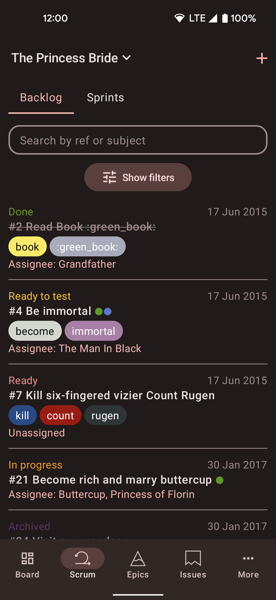
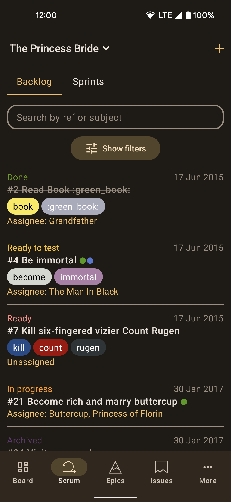
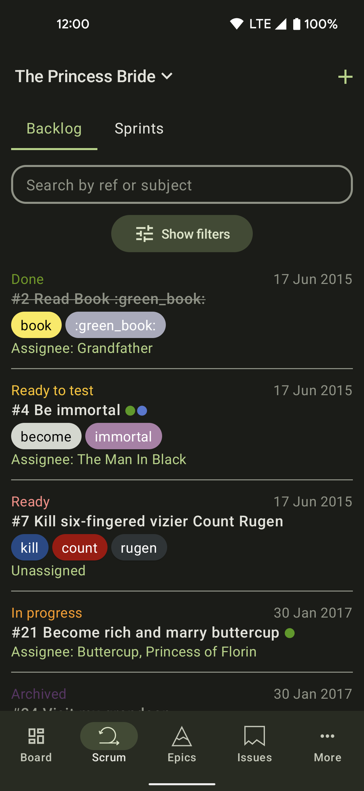
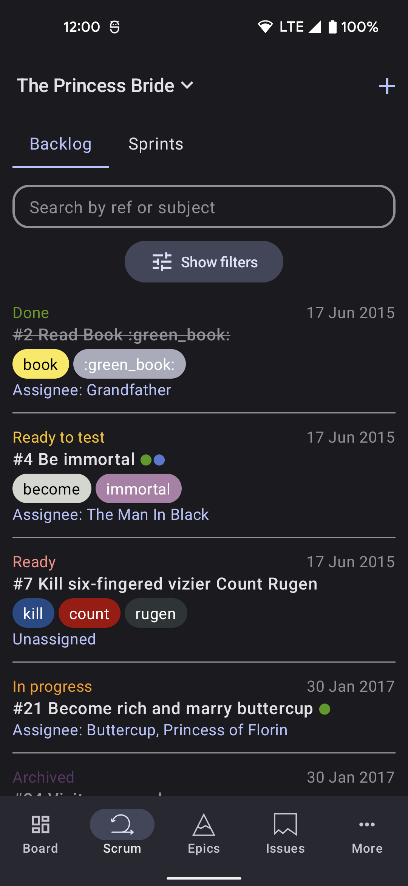
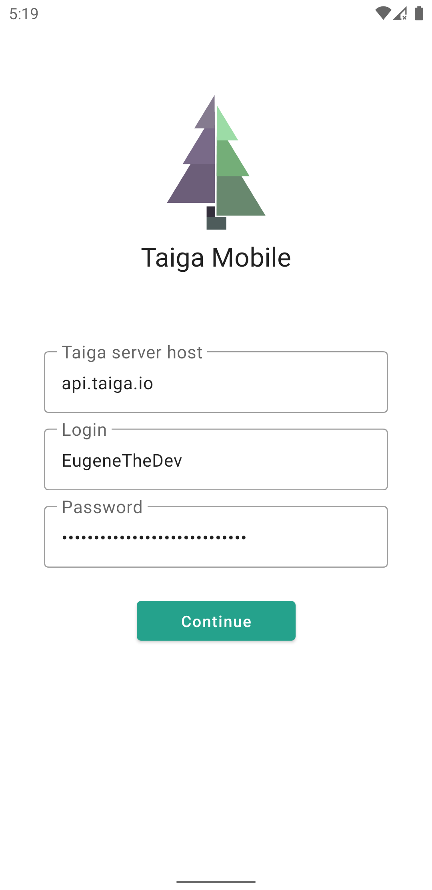
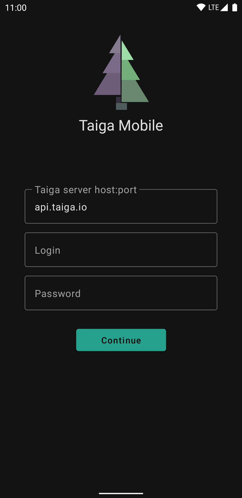
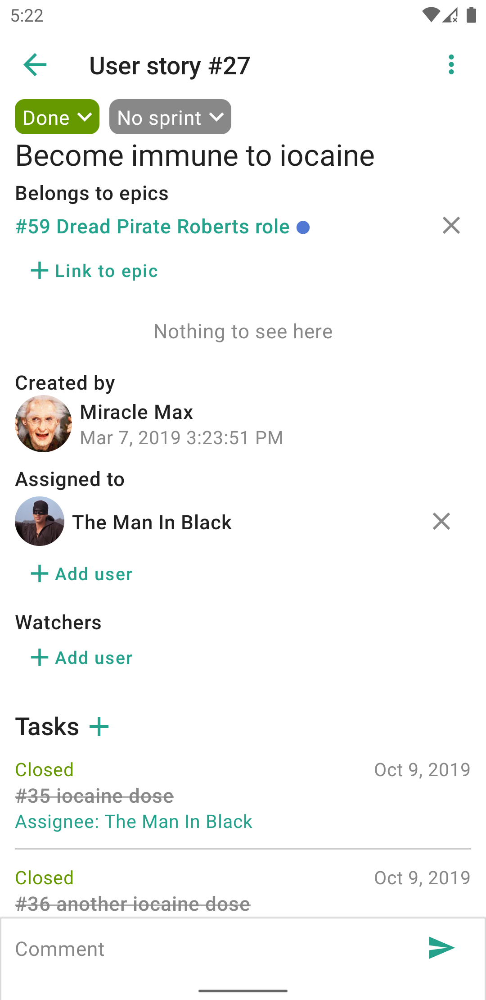
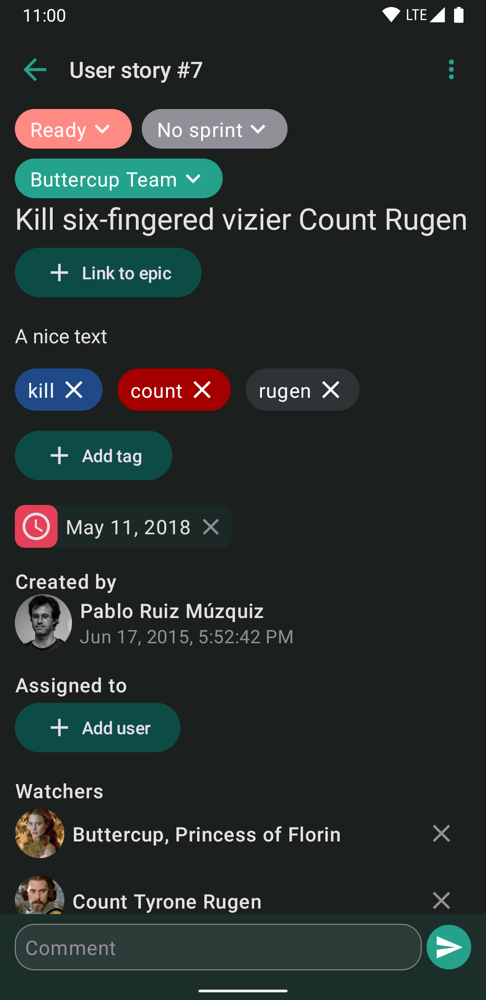
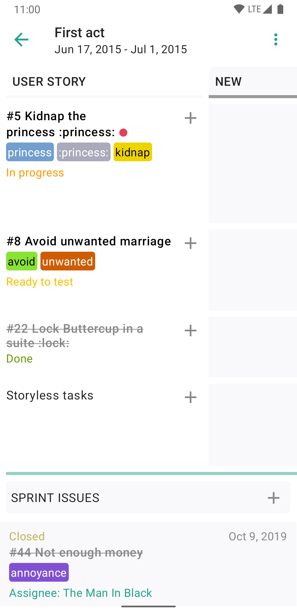
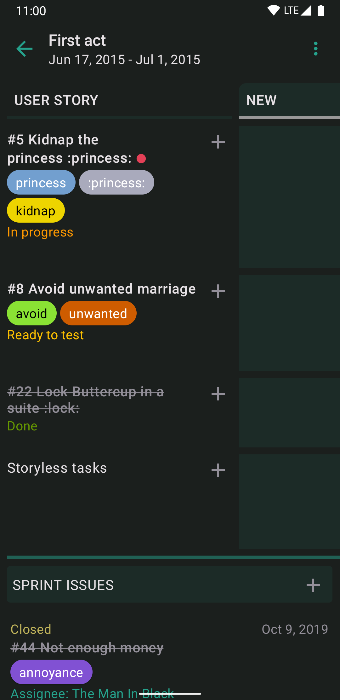

# TaigaMobile

This is the **unofficial** android app for the agile project management system [taiga.io](https://www.taiga.io/). It was built with [Jetpack Compose](https://developer.android.com/jetpack/compose), featuring Material You with dynamic colors. The project is still under development and new features will be added in the future.

 
 

## Features
* View:
  * Projects
  * Epics
  * User stories
  * Tasks
  * Issues
  * Sprints
  * Profiles
  * Working on / Watching (aka Dashboard)
* Create, edit and delete:
  * Epics
  * User stories
  * Tasks
  * Issues
  * Sprints
* Leave and delete comments
* Kanban (for sprint and for user stories)
* Filters for user stories, epics, issues

## Some screens
 
 
 

## Stack
* Kotlin
* Jetpack Compose
* Clean Architecture
* MVVM
* Coroutines
* ... and other cool things

## Design
Probably sucks. I'm not very good at designing UI, but I'm doing my best. So, if you have any suggestions, please tell me. I'll be really glad to receive any feedback.

## Download
Check out the app on [Google Play](https://play.google.com/store/apps/details?id=io.eugenethedev.taigamobile&utm_source=github) or go to the [Releases page](https://github.com/EugeneTheDev/TaigaMobile/releases) to download the latest apk.

## Issues
If you have any problems or suggestions, please submit an [Issue](https://github.com/EugeneTheDev/TaigaMobile/issues).
